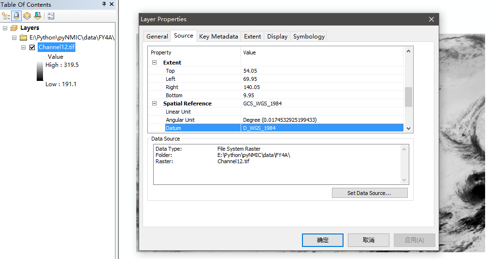
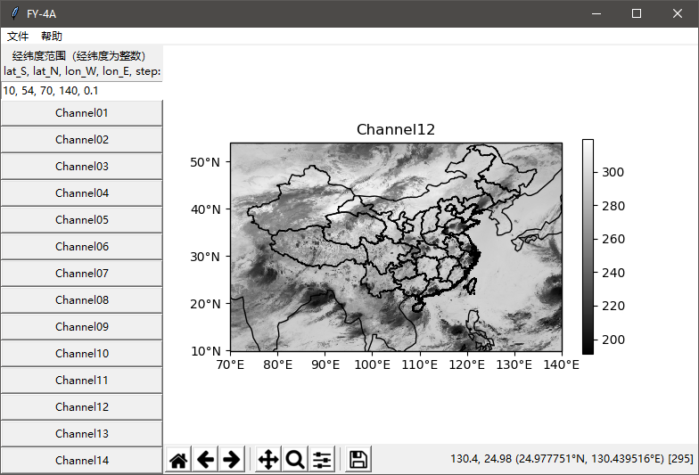
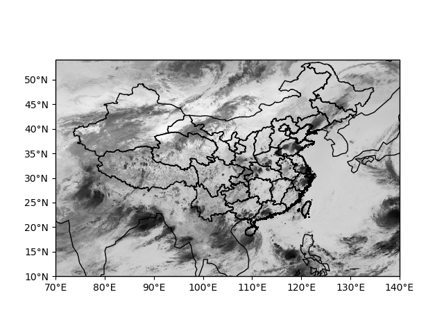
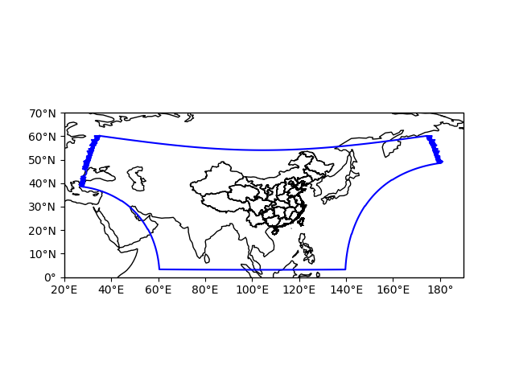

# FY-4A

2020-10-1：
- 用`xarray`重构了`fy4a.py`，支持多种定标方式、规避了部分缺失数据导致报错的bug
- 删去了`gui_tkinter.py`，那GUI写的太青涩了
- 删去了`tools.py`，由于用了`xarray`，可以轻松的保存nc等格式的文件
- 提供jupyter格式的[demo.ipynb](./demo.ipynb)

2019-8-26：
- `fy4a.py`增加缺测值的处理，修改了部分属性名
- 添加`tools.py`，包含写入goetiff的函数

- 将`test.py`改名为`demo.py`，主要演示如何使用`fy4a.py`和`tools.py`
- 改进`gui_tkinter.py`，`matplotlib`和`tkinter`似乎出现了一点不兼容，导致图片的工具栏无法正常使用，所以删掉了

2019-3-14：
- 不是是`pyshp`还是`Cartopy`更新后`Cartopy`无法打开含`gbk`编码的shp文件，所以把shp文件处理成utf-8的编码了
- 改变了文件目录结构

2018-12-9：
- 新增GUI(tkinter)，比较痛苦，显然不爱写界面的东西
- 面向对象重构`extract.py`为`fy4a.py`，感觉还行
- `test.py`没有同步更新
- 缺测值没有处理，一旦选定范围有缺测值就无法定标、出结果
- 信息显示有待完善（时间、文件名等）
- 图片工具条用的`matplotlib`自带的，方便但可能不好看、不好用
- 想尝试类似`jupyter notebook`那种和浏览器结合起来的交互界面

2018-11-20：
- 大量更新
- 放弃经纬度查找表，通过公式进行经纬度行列号互转

Tbb云顶亮温（Channel12）:

REGC大致范围:

2018-11-08：
国家卫星气象中心官网上提供的经纬度查找表有问题（至少4km的有问题）：
- `FY-4A数据行列号和经纬度的互相转换方法`中的`查表方法`教程pdf中说`高字节在前`其实是在后即小端存储格式；`前8字节为经度值，后8字节为纬度值`也说反了
- .gz文件应该不是标准的.gz格式，导致用gzip包无法直接打开，用7z手动解压也会提示`有效数据外包含额外数据`
- 官网提供的经纬度与行列号互转公式中星下点经度在不同情况下有时是弧度制有时是角度制千万注意
