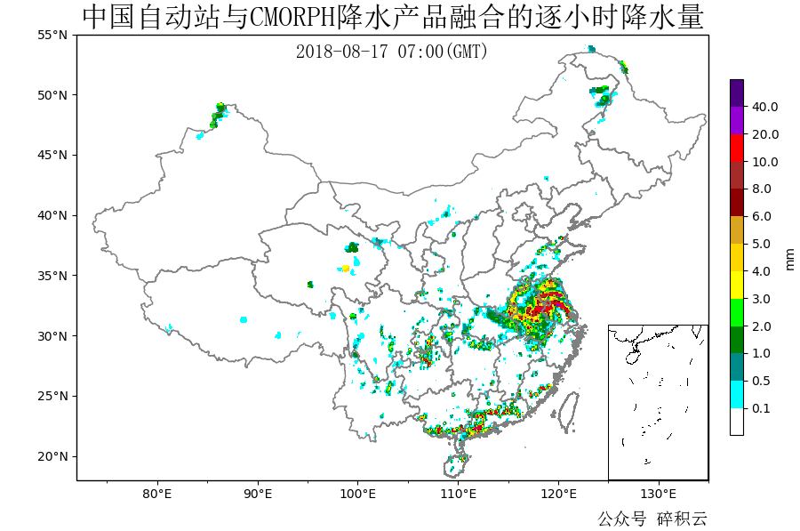
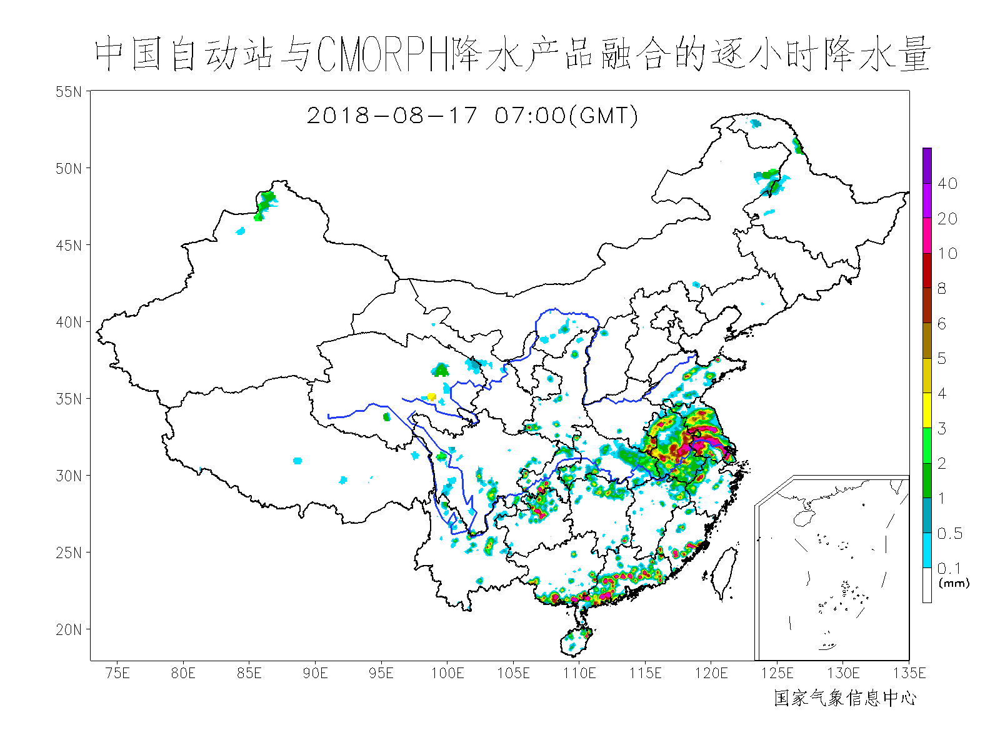

# GrADS

用于读取GrADS的二进制码数据

- 解析ctl文件
- 支持重设解析的`tdef`和字节顺序
- 支持LCC的`pdef`

使用方法详见 [demo.ipynb](./demo.ipynb)

已测试数据类型：
- [中国自动站与CMORPH融合的逐时降水量0.1°网格数据集（1.0版）](http://data.cma.cn/data/detail/dataCode/SEVP_CLI_CHN_MERGE_CMP_PRE_HOUR_GRID_0.10.html)

  出图如下：

  

  官网原图：
  

- WRF V3.8 MODEL输出的GrADS二进制码数据

不提供测试数据

各渠道接受改进建议
